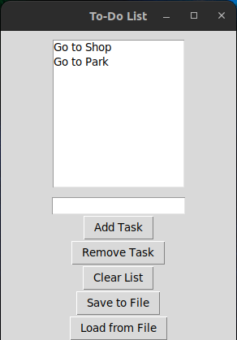

# To-Do List Application

This is a simple To-Do List application built using Python and the Tkinter library. It allows you to add, remove, and manage your tasks in a user-friendly interface. You can also save your to-do list to a file and load it from a file for convenience.



## Features

- **Add Tasks**: You can add tasks to your to-do list by typing them in the text entry field and clicking the "Add Task" button.

- **Remove Tasks**: Select a task from the list and click the "Remove Task" button to delete it.

- **Clear List**: The "Clear List" button allows you to remove all tasks from your to-do list at once.

- **Save to File**: Save your to-do list to a file named "todo.txt" by clicking the "Save to File" button.

- **Load from File**: Load tasks from the "todo.txt" file by clicking the "Load from File" button. If the file does not exist, the application will create one.

## Usage

1. **Adding a Task**:
   - Type your task in the text entry field.
   - Click the "Add Task" button.

2. **Removing a Task**:
   - Select the task you want to remove from the list.
   - Click the "Remove Task" button.

3. **Clearing the List**:
   - Click the "Clear List" button to remove all tasks from the list.

4. **Saving to a File**:
   - Click the "Save to File" button to save your to-do list to a file named "todo.txt."

5. **Loading from a File**:
   - Click the "Load from File" button to load tasks from the "todo.txt" file. If the file doesn't exist, it will be created.

## Getting Started

To run the application, make sure you have Python installed on your system. You will also need to have the Tkinter library, which is usually included with Python.

1. Clone the repository to your local machine:

   ```
   git clone https://github.com/beexoul/todo-list.git
   ```

2. Change to the project directory:

   ```
   cd todo-list
   ```

3. Run the application:

   ```
   python todo_list.py
   ```

Enjoy managing your tasks with this simple To-Do List application!
